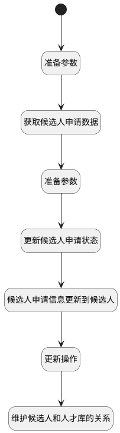

## 放入人才库 <!-- {docsify-ignore-all} -->

   

### 处理过程




### 处理步骤说明

#### 开始 :id=Begin<sup class="footnote-symbol"> <font color=gray size=1>[开始]</font></sup>


*- N/A*
#### 准备参数 :id=PREPAREPARAM2<sup class="footnote-symbol"> <font color=gray size=1>[准备参数]</font></sup>


1. 将`Default(传入变量).applicant_id` 设置给  `applicant(候选人申请).ID(标识)`

#### 获取候选人申请数据 :id=DEACTION2<sup class="footnote-symbol"> <font color=gray size=1>[实体行为]</font></sup>


调用实体 [候选人申请(HR_APPLICANT)](module/hr/hr_applicant.md) 行为 [Get](module/hr/hr_applicant#行为) ，行为参数为`applicant(候选人申请)`

将执行结果返回给参数`applicant(候选人申请)`

#### 准备参数 :id=PREPAREPARAM3<sup class="footnote-symbol"> <font color=gray size=1>[准备参数]</font></sup>


1. 将`0` 设置给  `applicant(候选人申请).STATUS(申请状态)`

#### 更新候选人申请状态 :id=DEACTION3<sup class="footnote-symbol"> <font color=gray size=1>[实体行为]</font></sup>


调用实体 [候选人申请(HR_APPLICANT)](module/hr/hr_applicant.md) 行为 [Update](module/hr/hr_applicant#行为) ，行为参数为`applicant(候选人申请)`

#### 候选人申请信息更新到候选人 :id=PREPAREPARAM1<sup class="footnote-symbol"> <font color=gray size=1>[准备参数]</font></sup>


1. 将`Default(传入变量).candidate_id` 设置给  `candidate(候选人).ID(标识)`
2. 将`Default(传入变量).LAST_TP_STAGE_NAME(归档前阶段)` 设置给  `candidate(候选人).LAST_TP_STAGE_NAME(归档前阶段)`
3. 将`applicant(候选人申请).LAST_EDU_SPECIALITY(所学专业)` 设置给  `candidate(候选人).LAST_EDU_SPECIALITY(所学专业)`
4. 将`applicant(候选人申请).LAST_EDU_SCHOOL(毕业院校)` 设置给  `candidate(候选人).LAST_EDU_SCHOOL(毕业院校)`
5. 将`applicant(候选人申请).LAST_EDU_ACADEMIC_DEGREE(最高学位)` 设置给  `candidate(候选人).LAST_EDU_ACADEMIC_DEGREE(最高学位)`
6. 将`applicant(候选人申请).LAST_EDU_DATE(毕业时间)` 设置给  `candidate(候选人).LAST_EDU_DATE(毕业时间)`
7. 将`applicant(候选人申请).LAST_EXP_COMPANY(最近工作公司)` 设置给  `candidate(候选人).LAST_EXP_COMPANY(最近工作公司)`
8. 将`applicant(候选人申请).LAST_EXP_DATE(最近工作时间)` 设置给  `candidate(候选人).LAST_EXP_DATE(最近工作时间)`
9. 将`applicant(候选人申请).LAST_EXP_JOB(最近工作岗位)` 设置给  `candidate(候选人).LAST_EXP_JOB(最近工作岗位)`
10. 将`applicant(候选人申请).TAGS(候选人标签)` 设置给  `candidate(候选人).LAST_TAGS(最新标签)`
11. 将`计算式 null` 设置给  `candidate(候选人).LAST_TP_ARCHIVED_AT(归档日期)`
12. 将`Default(传入变量).job_name` 设置给  `candidate(候选人).LAST_TP_JOB_NAME(申请职位)`
13. 将`Default(传入变量).last_tp_archive_reason(归档原因)` 设置给  `candidate(候选人).LAST_TP_ARCHIVE_REASON(归档原因)`
14. 将`Default(传入变量).last_tp_archive_reason_detail(归档详细原因)` 设置给  `candidate(候选人).LAST_TP_ARCHIVE_REASON_DETAIL(归档详细原因)`
15. 将`Default(传入变量).talentpool` 设置给  `candidate(候选人).LAST_TP_TALENT_POOL(归档人才库)`

#### 更新操作 :id=DEACTION1<sup class="footnote-symbol"> <font color=gray size=1>[实体行为]</font></sup>


调用实体 [候选人(HR_CANDIDATE)](module/hr/hr_candidate.md) 行为 [Update](module/hr/hr_candidate#行为) ，行为参数为`candidate(候选人)`

#### 维护候选人和人才库的关系 :id=RAWSFCODE1<sup class="footnote-symbol"> <font color=gray size=1>[直接后台代码]</font></sup>


<p class="panel-title"><b>执行代码[Groovy]</b></p>

```groovy
def candidate_talentpool = sys.dataentity('HR_CANDIDATE_TALENT_POOL');
def defaultParam = logic.param('default').getReal();

def candidateId = defaultParam.get("candidate_id")
def talentpoolJson = defaultParam.get("talentpool")
def talentpoolArray = new groovy.json.JsonSlurper().parseText(talentpoolJson)

talentpoolArray.each { talentpoolItem ->
    
    def newTalentpool = new net.ibizsys.central.util.EntityDTO(); 
    
    
    def talentpoolId = talentpoolItem.get("id")
    def talentpoolName = talentpoolItem.get("name")
    newTalentpool.set("talentpool_id", talentpoolId)
    newTalentpool.set("candidate_id", candidateId)
    newTalentpool.set("name", talentpoolName)
    

    candidate_talentpool.create(newTalentpool); 
}

```


### 实体逻辑参数

|    中文名   |    代码名    |  数据类型    |  实体   |备注 |
| --------| --------| -------- | -------- | --------   |
|传入变量(<i class="fa fa-check"/></i>)|Default|数据对象|[候选人(HR_CANDIDATE)](module/hr/hr_candidate.md)||
|候选人申请|applicant|数据对象|[候选人申请(HR_APPLICANT)](module/hr/hr_applicant.md)||
|候选人|candidate|数据对象|[候选人(HR_CANDIDATE)](module/hr/hr_candidate.md)||
|候选人_人才库|candidate_talentpool|数据对象|[候选者与人才库关系(HR_CANDIDATE_TALENT_POOL)](module/hr/hr_candidate_talent_pool.md)||
