## 今日归档人数 <!-- {docsify-ignore-all} -->

   

### 处理过程

```plantuml
@startuml
hide empty description
<style>
root {
  HyperlinkColor #42b983
}
</style>

hide empty description
state "开始" as Begin <<start>> [[$./get_archived_today_count#begin {"开始"}]]
state "今日归档人数" as RAWSQLCALL1  [[$./get_archived_today_count#rawsqlcall1 {"今日归档人数"}]]
state "结束" as END1 <<end>> [[$./get_archived_today_count#end1 {"结束"}]]


Begin --> RAWSQLCALL1
RAWSQLCALL1 --> END1


@enduml
```




### 处理步骤说明

#### 开始 :id=Begin<sup class="footnote-symbol"> <font color=gray size=1>[开始]</font></sup>


*- N/A*
#### 今日归档人数 :id=RAWSQLCALL1<sup class="footnote-symbol"> <font color=gray size=1>[直接SQL调用]</font></sup>


<p class="panel-title"><b>执行sql语句</b></p>

```sql
select count(1) archived_today_count  from hr_candidate hc where  DATE(hc.LAST_TP_ARCHIVED_AT) = CURRENT_DATE;
```


重置参数`archived_today_count(当日归档数)`，并将执行sql结果赋值给参数`archived_today_count(当日归档数)`

#### 结束 :id=END1<sup class="footnote-symbol"> <font color=gray size=1>[结束]</font></sup>


返回 `archived_today_count(当日归档数)`


### 实体逻辑参数

|    中文名   |    代码名    |  数据类型    |  实体   |备注 |
| --------| --------| -------- | -------- | --------   |
|传入变量(<i class="fa fa-check"/></i>)|Default|数据对象|[候选人(HR_CANDIDATE)](module/hr/hr_candidate.md)||
|当日归档数|archived_today_count|数据对象|||
