## 获取工作台面试数 <!-- {docsify-ignore-all} -->

   

### 处理过程

```plantuml
@startuml
hide empty description
<style>
root {
  HyperlinkColor #42b983
}
</style>

hide empty description
state "开始" as Begin <<start>> [[$./get_my_interview_count#begin {"开始"}]]
state "直接SQL调用" as RAWSQLCALL1  [[$./get_my_interview_count#rawsqlcall1 {"直接SQL调用"}]]
state "直接SQL调用" as RAWSQLCALL2  [[$./get_my_interview_count#rawsqlcall2 {"直接SQL调用"}]]
state "结束" as END1 <<end>> [[$./get_my_interview_count#end1 {"结束"}]]


Begin --> RAWSQLCALL1
RAWSQLCALL1 --> RAWSQLCALL2
RAWSQLCALL2 --> END1


@enduml
```




### 处理步骤说明

#### 开始 :id=Begin<sup class="footnote-symbol"> <font color=gray size=1>[开始]</font></sup>


*- N/A*
#### 直接SQL调用 :id=RAWSQLCALL1<sup class="footnote-symbol"> <font color=gray size=1>[直接SQL调用]</font></sup>


<p class="panel-title"><b>执行sql语句</b></p>

```sql
select
	count(1) as current
from
	hr_interview_feedback t1
left join hr_interview t2 on
	t1.interview_id = t2.id
left join hr_interview_schedule t3 on
	t2.schedule_id = t3.id
where
	t3.start_date = current_date and t1.INTERVIEWER_ID  = ?
```

<p class="panel-title"><b>执行sql参数</b></p>

1. `用户全局对象.srfuserid`

重置参数`result(计数器返回结果)`，并将执行sql结果赋值给参数`result(计数器返回结果)`

#### 直接SQL调用 :id=RAWSQLCALL2<sup class="footnote-symbol"> <font color=gray size=1>[直接SQL调用]</font></sup>


<p class="panel-title"><b>执行sql语句</b></p>

```sql
select
	count(1) as after
from
	hr_interview_feedback t1
left join hr_interview t2 on
	t1.interview_id = t2.id
left join hr_interview_schedule t3 on
	t2.schedule_id = t3.id
where
	t3.start_date > current_date
	and t1.INTERVIEWER_ID = ?
```

<p class="panel-title"><b>执行sql参数</b></p>

1. `用户全局对象.srfuserid`

重置参数`result(计数器返回结果)`，并将执行sql结果赋值给参数`result(计数器返回结果)`

#### 结束 :id=END1<sup class="footnote-symbol"> <font color=gray size=1>[结束]</font></sup>


返回 `result(计数器返回结果)`


### 实体逻辑参数

|    中文名   |    代码名    |  数据类型    |  实体   |备注 |
| --------| --------| -------- | -------- | --------   |
|传入变量(<i class="fa fa-check"/></i>)|Default|数据对象|[候选人(HR_CANDIDATE)](module/hr/hr_candidate.md)||
|计数器返回结果|result|数据对象|||
