## 我的待办事项清单计数器 <!-- {docsify-ignore-all} -->

   

### 处理过程

```plantuml
@startuml
hide empty description
<style>
root {
  HyperlinkColor #42b983
}
</style>

hide empty description
state "开始" as Begin <<start>> [[$./get_my_todolist_count#begin {"开始"}]]
state "今日待筛选人数" as PREPAREPARAM1  [[$./get_my_todolist_count#prepareparam1 {"今日待筛选人数"}]]
state "今日面试人数" as RAWSQLCALL2  [[$./get_my_todolist_count#rawsqlcall2 {"今日面试人数"}]]
state "待筛选简历" as RAWSQLCALL3  [[$./get_my_todolist_count#rawsqlcall3 {"待筛选简历"}]]
state "待发送offer" as RAWSQLCALL4  [[$./get_my_todolist_count#rawsqlcall4 {"待发送offer"}]]
state "待入职" as RAWSQLCALL5  [[$./get_my_todolist_count#rawsqlcall5 {"待入职"}]]
state "初试-待面试" as RAWSQLCALL6  [[$./get_my_todolist_count#rawsqlcall6 {"初试-待面试"}]]
state "初试-待反馈" as RAWSQLCALL7  [[$./get_my_todolist_count#rawsqlcall7 {"初试-待反馈"}]]
state "初试-待处理" as RAWSQLCALL8  [[$./get_my_todolist_count#rawsqlcall8 {"初试-待处理"}]]
state "结束" as END1 <<end>> [[$./get_my_todolist_count#end1 {"结束"}]]
state "复试-待处理" as RAWSQLCALL11  [[$./get_my_todolist_count#rawsqlcall11 {"复试-待处理"}]]
state "复试-待反馈" as RAWSQLCALL10  [[$./get_my_todolist_count#rawsqlcall10 {"复试-待反馈"}]]
state "复试-待面试" as RAWSQLCALL9  [[$./get_my_todolist_count#rawsqlcall9 {"复试-待面试"}]]


Begin --> PREPAREPARAM1
PREPAREPARAM1 --> RAWSQLCALL2
RAWSQLCALL2 --> RAWSQLCALL3
RAWSQLCALL3 --> RAWSQLCALL4
RAWSQLCALL4 --> RAWSQLCALL5
RAWSQLCALL5 --> RAWSQLCALL6
RAWSQLCALL6 --> RAWSQLCALL7
RAWSQLCALL7 --> RAWSQLCALL8
RAWSQLCALL8 --> RAWSQLCALL9
RAWSQLCALL9 --> RAWSQLCALL10
RAWSQLCALL10 --> RAWSQLCALL11
RAWSQLCALL11 --> END1


@enduml
```




### 处理步骤说明

#### 开始 :id=Begin<sup class="footnote-symbol"> <font color=gray size=1>[开始]</font></sup>


*- N/A*
#### 今日待筛选人数 :id=PREPAREPARAM1<sup class="footnote-symbol"> <font color=gray size=1>[准备参数]</font></sup>


1. 将`0` 设置给  `result.today_to_filter_apply`
2. 将`0` 设置给  `result.to_assign_resume`

#### 今日面试人数 :id=RAWSQLCALL2<sup class="footnote-symbol"> <font color=gray size=1>[直接SQL调用]</font></sup>


<p class="panel-title"><b>执行sql语句</b></p>

```sql
select count(1)as today_interview from hr_interview hi 
left join hr_interview_schedule his on hi.SCHEDULE_ID = his.id
where  DATE(his.START_DATE) = CURRENT_DATE;
```


重置参数`result(result)`，并将执行sql结果赋值给参数`result(result)`

#### 待筛选简历 :id=RAWSQLCALL3<sup class="footnote-symbol"> <font color=gray size=1>[直接SQL调用]</font></sup>


<p class="panel-title"><b>执行sql语句</b></p>

```sql
select count(1)as filter_apply from hr_applicant t inner join hr_recruitment_stage t2 on t.STAGE_ID  = t2.id where  t2.`SEQUENCE` = '20' and t.status = '1'
```


重置参数`result(result)`，并将执行sql结果赋值给参数`result(result)`

#### 待发送offer :id=RAWSQLCALL4<sup class="footnote-symbol"> <font color=gray size=1>[直接SQL调用]</font></sup>


<p class="panel-title"><b>执行sql语句</b></p>

```sql
select count(1)as to_send_offer from hr_applicant t inner join hr_recruitment_stage t2 on t.STAGE_ID  = t2.id where  t2.`SEQUENCE` = '70' and t.status = '1'
```


重置参数`result(result)`，并将执行sql结果赋值给参数`result(result)`

#### 待入职 :id=RAWSQLCALL5<sup class="footnote-symbol"> <font color=gray size=1>[直接SQL调用]</font></sup>


<p class="panel-title"><b>执行sql语句</b></p>

```sql
select count(1)as to_onboard from hr_applicant t inner join hr_recruitment_stage t2 on t.STAGE_ID  = t2.id where  t2.`SEQUENCE` = '80' and t.status = '1'
```


重置参数`result(result)`，并将执行sql结果赋值给参数`result(result)`

#### 初试-待面试 :id=RAWSQLCALL6<sup class="footnote-symbol"> <font color=gray size=1>[直接SQL调用]</font></sup>


<p class="panel-title"><b>执行sql语句</b></p>

```sql
select
	count(1) as first_interview_pending
from
	hr_applicant t
inner join hr_recruitment_stage t2 on
	t.STAGE_ID = t2.id
where
	t2.`SEQUENCE` = '40'
	and t.status = '1'
	and exists(
		select * from hr_interview t3 inner join hr_applicant_interview t4 on t3.id = t4.interview_id
			where  t3.STAGE_ID = '1' and t3.STATUS  = '1' and t4.APPLICANT_ID  = t.ID 
	)
```


重置参数`result(result)`，并将执行sql结果赋值给参数`result(result)`

#### 初试-待反馈 :id=RAWSQLCALL7<sup class="footnote-symbol"> <font color=gray size=1>[直接SQL调用]</font></sup>


<p class="panel-title"><b>执行sql语句</b></p>

```sql
select
	count(1) as first_feedback_pending
from
	hr_applicant t
inner join hr_recruitment_stage t2 on
	t.STAGE_ID = t2.id
where
	t2.`SEQUENCE` = '40'
	and t.status = '1'
	and 
	exists(
		select * from hr_interview t3 
		inner join hr_applicant_interview t4 on t3.id = t4.interview_id 
		inner join hr_interview_feedback t5  on t3.id = t5.INTERVIEW_ID 
		where 
		t3.STAGE_ID = '1' and t3.STATUS  = '2'
		and t.id = t5.APPLICANT_ID  and t5.RESULT_TYPE  is null
	)
```


重置参数`result(result)`，并将执行sql结果赋值给参数`result(result)`

#### 初试-待处理 :id=RAWSQLCALL8<sup class="footnote-symbol"> <font color=gray size=1>[直接SQL调用]</font></sup>


<p class="panel-title"><b>执行sql语句</b></p>

```sql
select
	count(1) as first_process_pending
from
	hr_applicant t
inner join hr_recruitment_stage t2 on
	t.STAGE_ID = t2.id
where
	t2.`SEQUENCE` = '40'
	and t.status = '1'
	and exists(
	    select * from(
			    select 
			       t5.APPLICANT_ID,
		           count(1) as cnt 
		           from hr_interview t3 
				inner join hr_applicant_interview t4 on t3.id = t4.interview_id 
				inner join hr_interview_feedback t5 on t3.id = t5.INTERVIEW_ID 
				where 
				t3.STAGE_ID = '1' and t3.STATUS = '2'
				and t5.RESULT_TYPE is null
		    	group by t5.APPLICANT_ID 
	    	) as sub 
	        where sub.APPLICANT_ID = t.id  
	          and sub.cnt = 0  
    )
```


重置参数`result(result)`，并将执行sql结果赋值给参数`result(result)`

#### 结束 :id=END1<sup class="footnote-symbol"> <font color=gray size=1>[结束]</font></sup>


返回 `result`

#### 复试-待处理 :id=RAWSQLCALL11<sup class="footnote-symbol"> <font color=gray size=1>[直接SQL调用]</font></sup>


<p class="panel-title"><b>执行sql语句</b></p>

```sql
select
	count(1) as second_process_pending
from
	hr_applicant t
inner join hr_recruitment_stage t2 on
	t.STAGE_ID = t2.id
where
	t2.`SEQUENCE` = '60'
	and t.status = '1'
	and exists(
	    select * from(
			    select 
			       t5.APPLICANT_ID,
		           count(1) as cnt 
		           from hr_interview t3 
				inner join hr_applicant_interview t4 on t3.id = t4.interview_id 
				inner join hr_interview_feedback t5 on t3.id = t5.INTERVIEW_ID 
				where 
				t3.STAGE_ID = '2' and t3.STATUS = '2'
				and t5.RESULT_TYPE is null
		    	group by t5.APPLICANT_ID 
	    	) as sub 
	        where sub.APPLICANT_ID = t.id  
	          and sub.cnt = 0  
    )
```


重置参数`result(result)`，并将执行sql结果赋值给参数`result(result)`

#### 复试-待反馈 :id=RAWSQLCALL10<sup class="footnote-symbol"> <font color=gray size=1>[直接SQL调用]</font></sup>


<p class="panel-title"><b>执行sql语句</b></p>

```sql
select
	count(1) as second_feedback_pending
from
	hr_applicant t
inner join hr_recruitment_stage t2 on
	t.STAGE_ID = t2.id
where
	t2.`SEQUENCE` = '60'
	and t.status = '1'
	and 
	exists(
		select * from hr_interview t3 
		inner join hr_applicant_interview t4 on t3.id = t4.interview_id 
		inner join hr_interview_feedback t5  on t3.id = t5.INTERVIEW_ID 
		where 
		t3.STAGE_ID = '2' and t3.STATUS  = '2'
		and t.id = t5.APPLICANT_ID  and t5.RESULT_TYPE  is null
	)
```


重置参数`result(result)`，并将执行sql结果赋值给参数`result(result)`

#### 复试-待面试 :id=RAWSQLCALL9<sup class="footnote-symbol"> <font color=gray size=1>[直接SQL调用]</font></sup>


<p class="panel-title"><b>执行sql语句</b></p>

```sql
select
	count(1) as second_interview_pending
from
	hr_applicant t
inner join hr_recruitment_stage t2 on
	t.STAGE_ID = t2.id
where
	t2.`SEQUENCE` = '60'
	and t.status = '1'
	and exists(
		select * from hr_interview t3 inner join hr_applicant_interview t4 on t3.id = t4.interview_id
			where  t3.STAGE_ID = '2' and t3.STATUS  = '1' and t4.APPLICANT_ID  = t.ID 
	)
```


重置参数`result(result)`，并将执行sql结果赋值给参数`result(result)`


### 实体逻辑参数

|    中文名   |    代码名    |  数据类型    |  实体   |备注 |
| --------| --------| -------- | -------- | --------   |
|传入变量(<i class="fa fa-check"/></i>)|Default|数据对象|[候选人(HR_CANDIDATE)](module/hr/hr_candidate.md)||
|result|result|数据对象|||
