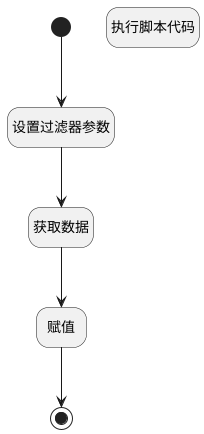

## 获取信息 <!-- {docsify-ignore-all} -->

   

### 处理过程




### 处理步骤说明

#### 开始 :id=Begin<sup class="footnote-symbol"> <font color=gray size=1>[开始]</font></sup>


*- N/A*
#### 设置过滤器参数 :id=PREPAREPARAM1<sup class="footnote-symbol"> <font color=gray size=1>[准备参数]</font></sup>


1. 将`Default(传入变量).ID(标识)` 设置给  `filter.N_APPLICANT_ID_EQ`

#### 获取数据 :id=DEDATASET1<sup class="footnote-symbol"> <font color=gray size=1>[实体数据集]</font></sup>


调用实体 [筛选候选人(HR_CANDIDATE_FILTER)](module/hr/hr_candidate_filter.md) 数据集合 [数据集(DEFAULT)](module/hr/hr_candidate_filter#数据集合) ，查询参数为`filter`

将执行结果返回给参数`list`

#### 执行脚本代码 :id=RAWSFCODE1<sup class="footnote-symbol"> <font color=gray size=1>[直接后台代码]</font></sup>


<p class="panel-title"><b>执行代码[Groovy]</b></p>

```groovy
def _default = logic.param('Default').getReal()
println " _default ${_default}"


def hr_candidate_filter = logic.param('filter').getReal()

String applicant_id = _default.get('id')

def hrCandidateFilterRuntime = sys.dataentity('hr_candidate_filter')


def filter = hrCandidateFilterRuntime.filter()
filter.eq('applicant_id', applicant_id)
hr_candidate_filter = hrCandidateFilterRuntime.selectOne(filter) as IEntityDTO

println "${hr_candidate_filter}"

```

#### 赋值 :id=PREPAREPARAM2<sup class="footnote-symbol"> <font color=gray size=1>[准备参数]</font></sup>


1. 将`list.0` 设置给  `Default(传入变量).HR_CANDIDATE_FILTER`

#### 结束 :id=END1<sup class="footnote-symbol"> <font color=gray size=1>[结束]</font></sup>


返回 `Default(传入变量).HR_CANDIDATE_FILTER`


### 实体逻辑参数

|    中文名   |    代码名    |  数据类型    |  实体   |备注 |
| --------| --------| -------- | -------- | --------   |
|传入变量(<i class="fa fa-check"/></i>)|Default|数据对象|[筛选候选人(HR_CANDIDATE_FILTER)](module/hr/hr_candidate_filter.md)||
|HR_CANDIDATE_FILTER|HR_CANDIDATE_FILTER|数据对象|[筛选候选人(HR_CANDIDATE_FILTER)](module/hr/hr_candidate_filter.md)||
|filter|filter|过滤器|||
|list|list|分页查询|||
