## 用人经理-简历筛选-搜索栏计数器 <!-- {docsify-ignore-all} -->

   

### 处理过程

```plantuml
@startuml
hide empty description
<style>
root {
  HyperlinkColor #42b983
}
</style>

hide empty description
state "开始" as Begin <<start>> [[$./my_filter_count#begin {"开始"}]]
state "待筛选的候选人" as RAWSQLCALL_01  [[$./my_filter_count#rawsqlcall_01 {"待筛选的候选人"}]]
state "可面试的候选人" as RAWSQLCALL_02  [[$./my_filter_count#rawsqlcall_02 {"可面试的候选人"}]]
state "已推荐的候选人" as RAWSQLCALL_03  [[$./my_filter_count#rawsqlcall_03 {"已推荐的候选人"}]]
state "筛选记录" as RAWSQLCALL_04  [[$./my_filter_count#rawsqlcall_04 {"筛选记录"}]]
state "结束" as END_01 <<end>> [[$./my_filter_count#end_01 {"结束"}]]


Begin --> RAWSQLCALL_01
RAWSQLCALL_01 --> RAWSQLCALL_02
RAWSQLCALL_02 --> RAWSQLCALL_03
RAWSQLCALL_03 --> RAWSQLCALL_04
RAWSQLCALL_04 --> END_01


@enduml
```




### 处理步骤说明

#### 开始 :id=Begin<sup class="footnote-symbol"> <font color=gray size=1>[开始]</font></sup>


*- N/A*
#### 待筛选的候选人 :id=RAWSQLCALL_01<sup class="footnote-symbol"> <font color=gray size=1>[直接SQL调用]</font></sup>


<p class="panel-title"><b>执行sql语句</b></p>

```sql
SELECT COUNT(1) as todo
FROM hr_candidate_filter_detail hcfd where hcfd.status = 1 and hcfd.USER_ID = ?
```

<p class="panel-title"><b>执行sql参数</b></p>

1. `用户全局对象.srfuserid`

重置参数`result(结果)`，并将执行sql结果赋值给参数`result(结果)`

#### 可面试的候选人 :id=RAWSQLCALL_02<sup class="footnote-symbol"> <font color=gray size=1>[直接SQL调用]</font></sup>


<p class="panel-title"><b>执行sql语句</b></p>

```sql
SELECT COUNT(1) as doing
FROM hr_candidate_filter_detail hcfd where hcfd.status = 4 and hcfd.USER_ID = ?
```

<p class="panel-title"><b>执行sql参数</b></p>

1. `用户全局对象.srfuserid`

重置参数`result(结果)`，并将执行sql结果赋值给参数`result(结果)`

#### 已推荐的候选人 :id=RAWSQLCALL_03<sup class="footnote-symbol"> <font color=gray size=1>[直接SQL调用]</font></sup>


<p class="panel-title"><b>执行sql语句</b></p>

```sql
SELECT COUNT(1) as recommend
FROM hr_candidate_filter_detail hcfd where hcfd.status = 4  and hcfd.USER_ID = ?
```

<p class="panel-title"><b>执行sql参数</b></p>

1. `用户全局对象.srfuserid`

重置参数`result(结果)`，并将执行sql结果赋值给参数`result(结果)`

#### 筛选记录 :id=RAWSQLCALL_04<sup class="footnote-symbol"> <font color=gray size=1>[直接SQL调用]</font></sup>


<p class="panel-title"><b>执行sql语句</b></p>

```sql
SELECT COUNT(1) as done
FROM hr_candidate_filter_detail hcfd where hcfd.status <> 1 and  hcfd.STATUS  is not null  and hcfd.USER_ID = ?
```

<p class="panel-title"><b>执行sql参数</b></p>

1. `用户全局对象.srfuserid`

重置参数`result(结果)`，并将执行sql结果赋值给参数`result(结果)`

#### 结束 :id=END_01<sup class="footnote-symbol"> <font color=gray size=1>[结束]</font></sup>


返回 `result(结果)`


### 实体逻辑参数

|    中文名   |    代码名    |  数据类型    |  实体   |备注 |
| --------| --------| -------- | -------- | --------   |
|传入变量(<i class="fa fa-check"/></i>)|Default|数据对象|[筛选候选人明细(HR_CANDIDATE_FILTER_DETAIL)](module/hr/hr_candidate_filter_detail.md)||
|结果|result|数据对象|||
