## 招聘需求搜索栏计数 <!-- {docsify-ignore-all} -->

   

### 处理过程

```plantuml
@startuml
hide empty description
<style>
root {
  HyperlinkColor #42b983
}
</style>

hide empty description
state "开始" as Begin <<start>> [[$./idea_status_count#begin {"开始"}]]
state "草稿阶段" as RAWSQLCALL_01  [[$./idea_status_count#rawsqlcall_01 {"草稿阶段"}]]
state "未进行阶段" as RAWSQLCALL_02  [[$./idea_status_count#rawsqlcall_02 {"未进行阶段"}]]
state "进行中阶段" as RAWSQLCALL_03  [[$./idea_status_count#rawsqlcall_03 {"进行中阶段"}]]
state "已完成阶段" as RAWSQLCALL_04  [[$./idea_status_count#rawsqlcall_04 {"已完成阶段"}]]
state "已暂停阶段" as RAWSQLCALL_05  [[$./idea_status_count#rawsqlcall_05 {"已暂停阶段"}]]
state "已取消阶段" as RAWSQLCALL_06  [[$./idea_status_count#rawsqlcall_06 {"已取消阶段"}]]
state "已超期阶段" as RAWSQLCALL_07  [[$./idea_status_count#rawsqlcall_07 {"已超期阶段"}]]
state "结束" as END_01 <<end>> [[$./idea_status_count#end_01 {"结束"}]]


Begin --> RAWSQLCALL_01
RAWSQLCALL_01 --> RAWSQLCALL_02
RAWSQLCALL_02 --> RAWSQLCALL_03
RAWSQLCALL_03 --> RAWSQLCALL_04
RAWSQLCALL_04 --> RAWSQLCALL_05
RAWSQLCALL_05 --> RAWSQLCALL_06
RAWSQLCALL_06 --> RAWSQLCALL_07
RAWSQLCALL_07 --> END_01


@enduml
```




### 处理步骤说明

#### 草稿阶段 :id=RAWSQLCALL_01<sup class="footnote-symbol"> <font color=gray size=1>[直接SQL调用]</font></sup>


<p class="panel-title"><b>执行sql语句</b></p>

```sql
select count(1) as draft from hr_idea thi where status = 'draft'
```


重置参数`result(结果)`，并将执行sql结果赋值给参数`result(结果)`

#### 开始 :id=Begin<sup class="footnote-symbol"> <font color=gray size=1>[开始]</font></sup>


*- N/A*
#### 未进行阶段 :id=RAWSQLCALL_02<sup class="footnote-symbol"> <font color=gray size=1>[直接SQL调用]</font></sup>


<p class="panel-title"><b>执行sql语句</b></p>

```sql
select count(1) as unstart from hr_idea thi where status = 'unstart'
```


重置参数`result(结果)`，并将执行sql结果赋值给参数`result(结果)`

#### 进行中阶段 :id=RAWSQLCALL_03<sup class="footnote-symbol"> <font color=gray size=1>[直接SQL调用]</font></sup>


<p class="panel-title"><b>执行sql语句</b></p>

```sql
select  count(1) as ongoing from hr_idea thi where status = 'ongoing'
```


重置参数`result(结果)`，并将执行sql结果赋值给参数`result(结果)`

#### 已完成阶段 :id=RAWSQLCALL_04<sup class="footnote-symbol"> <font color=gray size=1>[直接SQL调用]</font></sup>


<p class="panel-title"><b>执行sql语句</b></p>

```sql
select  count(1) as complete from hr_idea thi where status = 'complete'
```


重置参数`result(结果)`，并将执行sql结果赋值给参数`result(结果)`

#### 已暂停阶段 :id=RAWSQLCALL_05<sup class="footnote-symbol"> <font color=gray size=1>[直接SQL调用]</font></sup>


<p class="panel-title"><b>执行sql语句</b></p>

```sql
select  count(1) as suspend from hr_idea thi where status = 'suspend'
```


重置参数`result(结果)`，并将执行sql结果赋值给参数`result(结果)`

#### 已取消阶段 :id=RAWSQLCALL_06<sup class="footnote-symbol"> <font color=gray size=1>[直接SQL调用]</font></sup>


<p class="panel-title"><b>执行sql语句</b></p>

```sql
select  count(1) as canceled from hr_idea thi where status = 'canceled'
```


重置参数`result(结果)`，并将执行sql结果赋值给参数`result(结果)`

#### 已超期阶段 :id=RAWSQLCALL_07<sup class="footnote-symbol"> <font color=gray size=1>[直接SQL调用]</font></sup>


<p class="panel-title"><b>执行sql语句</b></p>

```sql
select  count(1) as timeout from hr_idea thi where status = 'timeout'
```


重置参数`result(结果)`，并将执行sql结果赋值给参数`result(结果)`

#### 结束 :id=END_01<sup class="footnote-symbol"> <font color=gray size=1>[结束]</font></sup>


返回 `result(结果)`


### 实体逻辑参数

|    中文名   |    代码名    |  数据类型    |  实体   |备注 |
| --------| --------| -------- | -------- | --------   |
|传入变量(<i class="fa fa-check"/></i>)|Default|数据对象|[招聘需求(HR_IDEA)](module/hr/hr_idea.md)||
|结果|result|数据对象|||
