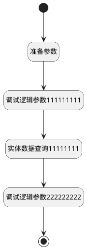

## 获取关联职位 <!-- {docsify-ignore-all} -->

   

### 处理过程

### 处理步骤说明

#### 开始 :id=Begin [开始]

*- N/A*
#### 结束 :id=END1 [结束]

*- N/A*

#### 准备参数 :id=PREPAREPARAM1 [准备参数]

    无

#### 调试逻辑参数111111111 :id=DEBUGPARAM2 [调试逻辑参数]

> [!NOTE|label:调试信息|icon:fa fa-bug]
> 调试输出参数`Default(传入变量)`的详细信息

#### 实体数据查询11111111 :id=DEDATAQUERY1 [实体数据查询]

调用实体 [需求与职位关系(HR_IDEA_JOB)](module/hr/hr_idea_job.md) 数据查询 [数据查询(DEFAULT)](module/hr/hr_idea_job#数据查询) ，查询参数为`idea_job`

将执行结果返回给参数`idea_job_list`

#### 调试逻辑参数222222222 :id=DEBUGPARAM1 [调试逻辑参数]

> [!NOTE|label:调试信息|icon:fa fa-bug]
> 调试输出参数`idea_job_list`的详细信息

### 实体逻辑参数

|    中文名   |    代码名    |  数据类型    |  实体   |备注 |
| --------| --------| -------- | -------- | --------   |
|传入变量(<i class="fa fa-check"/></i>)|Default|数据对象|[需求与职位关系(HR_IDEA_JOB)](module/hr/hr_idea_job.md)||
|idea_job|idea_job|过滤器|||
|idea_job_list|idea_job_list|数据对象列表|[需求与职位关系(HR_IDEA_JOB)](module/hr/hr_idea_job.md)||
