## 关联职位 <!-- {docsify-ignore-all} -->

   

### 处理过程

```plantuml
@startuml
hide empty description
<style>
root {
  HyperlinkColor #42b983
}
</style>

hide empty description
state "开始" as Begin <<start>> [[$./join_idea_job#begin {"开始"}]]
state "需求关联职位" as RAWSFCODE  [[$./join_idea_job#rawsfcode {"需求关联职位"}]]
state "结束" as END1 <<end>> [[$./join_idea_job#end1 {"结束"}]]


Begin --> RAWSFCODE
RAWSFCODE --> END1


@enduml
```




### 处理步骤说明

#### 开始 :id=Begin<sup class="footnote-symbol"> <font color=gray size=1>[开始]</font></sup>


*- N/A*
#### 需求关联职位 :id=RAWSFCODE<sup class="footnote-symbol"> <font color=gray size=1>[直接后台代码]</font></sup>


<p class="panel-title"><b>执行代码[Groovy]</b></p>

```groovy
// 获取默认参数
def _default = logic.param('Default').getReal()

String ideaID = _default.get('hr_idea')
// 直接获取srfactionparam为List<Map>，无需转换为IEntityDTO
List<Map> srfactionparam = _default.get('srfactionparam')
Map actionParam = srfactionparam.get(0) // 取第一个元素（Map类型）

// 从Map中直接获取reviewer_user_ids字段
String reviewerUserIds = actionParam.get('name')

// 解析JSON并提取id列表
def jsonSlurper = new groovy.json.JsonSlurper()
def list = jsonSlurper.parseText(reviewerUserIds)
def ids = list.collect { it.id } // 提取所有id

// 创建主表实体
def hrIdeaJobRuntime = sys.dataentity('HR_IDEA_JOB')

ids.each { id ->
    def hrIdeaJobEntity = hrIdeaJobRuntime.createEntity()
    hrIdeaJobEntity.set("Idea_id", ideaID)
    hrIdeaJobEntity.set("Job_id", id)
    hrIdeaJobRuntime.save(hrIdeaJobEntity)
}
```

#### 结束 :id=END1<sup class="footnote-symbol"> <font color=gray size=1>[结束]</font></sup>


*- N/A*


### 实体逻辑参数

|    中文名   |    代码名    |  数据类型    |  实体   |备注 |
| --------| --------| -------- | -------- | --------   |
|传入变量(<i class="fa fa-check"/></i>)|Default|数据对象|[需求与职位关系(HR_IDEA_JOB)](module/hr/hr_idea_job.md)||
