## 创建面试详情(参与者、待反馈） <!-- {docsify-ignore-all} -->

   

### 处理过程

```plantuml
@startuml
hide empty description
<style>
root {
  HyperlinkColor #42b983
}
</style>

hide empty description
state "开始" as Begin <<start>> [[$./create_interview_info#begin {"开始"}]]
state "调试逻辑参数" as DEBUGPARAM1  [[$./create_interview_info#debugparam1 {"调试逻辑参数"}]]
state "调试逻辑参数" as DEBUGPARAM2  [[$./create_interview_info#debugparam2 {"调试逻辑参数"}]]
state "准备参数" as PREPAREPARAM3  [[$./create_interview_info#prepareparam3 {"准备参数"}]]
state "获取候选人申请" as DEACTION4  [[$./create_interview_info#deaction4 {"获取候选人申请"}]]
state "准备申请面试关系" as PREPAREPARAM1  [[$./create_interview_info#prepareparam1 {"准备申请面试关系"}]]
state "保存申请面试关系" as DEACTION1  [[$./create_interview_info#deaction1 {"保存申请面试关系"}]]
state "设置候选人" as PREPAREPARAM2  [[$./create_interview_info#prepareparam2 {"设置候选人"}]]
state "保存候选人" as DEACTION3  [[$./create_interview_info#deaction3 {"保存候选人"}]]
state "绑定参数" as BINDPARAM1  [[$./create_interview_info#bindparam1 {"绑定参数"}]]
state "循环子调用" as LOOPSUBCALL1  [[$./create_interview_info#loopsubcall1 {"循环子调用"}]] #green {
state "准备面试官" as PREPAREPARAM4  [[$./create_interview_info#prepareparam4 {"准备面试官"}]]
state "保存面试官" as DEACTION2  [[$./create_interview_info#deaction2 {"保存面试官"}]]
state "准备面试反馈" as PREPAREPARAM5  [[$./create_interview_info#prepareparam5 {"准备面试反馈"}]]
state "创建面试反馈" as DEACTION5  [[$./create_interview_info#deaction5 {"创建面试反馈"}]]
state "重新建立参数" as RENEWPARAM1  [[$./create_interview_info#renewparam1 {"重新建立参数"}]]
state "重新建立参数" as RENEWPARAM2  [[$./create_interview_info#renewparam2 {"重新建立参数"}]]
}


Begin --> DEBUGPARAM1
DEBUGPARAM1 --> PREPAREPARAM3
PREPAREPARAM3 --> DEBUGPARAM2
DEBUGPARAM2 --> DEACTION4
DEACTION4 --> PREPAREPARAM1
PREPAREPARAM1 --> DEACTION1
DEACTION1 --> PREPAREPARAM2
PREPAREPARAM2 --> DEACTION3
DEACTION3 --> BINDPARAM1
BINDPARAM1 --> LOOPSUBCALL1
LOOPSUBCALL1 --> PREPAREPARAM4
PREPAREPARAM4 --> DEACTION2
DEACTION2 --> PREPAREPARAM5
PREPAREPARAM5 --> DEACTION5
DEACTION5 --> RENEWPARAM1
RENEWPARAM1 --> RENEWPARAM2


@enduml
```




### 处理步骤说明

#### 开始 :id=Begin<sup class="footnote-symbol"> <font color=gray size=1>[开始]</font></sup>


*- N/A*
#### 调试逻辑参数 :id=DEBUGPARAM1<sup class="footnote-symbol"> <font color=gray size=1>[调试逻辑参数]</font></sup>


> [!NOTE|label:调试信息|icon:fa fa-bug]
> 调试输出参数`Default(传入变量)`的详细信息


#### 调试逻辑参数 :id=DEBUGPARAM2<sup class="footnote-symbol"> <font color=gray size=1>[调试逻辑参数]</font></sup>


> [!NOTE|label:调试信息|icon:fa fa-bug]
> 调试输出参数`hr_applicant`的详细信息


#### 准备参数 :id=PREPAREPARAM3<sup class="footnote-symbol"> <font color=gray size=1>[准备参数]</font></sup>


1. 将`session_entity.applicant_ids` 设置给  `hr_applicant.ID(标识)`

#### 获取候选人申请 :id=DEACTION4<sup class="footnote-symbol"> <font color=gray size=1>[实体行为]</font></sup>


调用实体 [候选人申请(HR_APPLICANT)](module/hr/hr_applicant.md) 行为 [Get](module/hr/hr_applicant#行为) ，行为参数为`hr_applicant`

将执行结果返回给参数`hr_applicant`

#### 准备申请面试关系 :id=PREPAREPARAM1<sup class="footnote-symbol"> <font color=gray size=1>[准备参数]</font></sup>


1. 将`hr_applicant.ID(标识)` 设置给  `applicant_interview.APPLICANT_ID(候选人申请)`
2. 将`Default(传入变量).ID(标识)` 设置给  `applicant_interview.INTERVIEW_ID(面试)`

#### 保存申请面试关系 :id=DEACTION1<sup class="footnote-symbol"> <font color=gray size=1>[实体行为]</font></sup>


调用实体 [候选人申请与面试关系(HR_APPLICANT_INTERVIEW)](module/hr/hr_applicant_interview.md) 行为 [Create](module/hr/hr_applicant_interview#行为) ，行为参数为`applicant_interview`

#### 设置候选人 :id=PREPAREPARAM2<sup class="footnote-symbol"> <font color=gray size=1>[准备参数]</font></sup>


1. 将`hr_applicant.CANDIDATE_ID(候选人)` 设置给  `interview_user2.USER_ID(面试参与者)`
2. 将`Default(传入变量).ID(标识)` 设置给  `interview_user2.INTERVIEW_ID(面试)`
3. 将`hr_applicant.ID(标识)` 设置给  `interview_user2.APPLICANT_ID(候选人申请)`
4. 将`2` 设置给  `interview_user2.USER_TYPE(面试参与者类型)`
5. 将`https://meeting.tencent.com/dm/o8WT7tIry9tb` 设置给  `interview_user2.VIDEO_URL(会议链接)`
6. 将`hr_applicant.CANDIDATE_NAME(候选人名称)` 设置给  `interview_user2.USER_NAME(面试参与者)`

#### 保存候选人 :id=DEACTION3<sup class="footnote-symbol"> <font color=gray size=1>[实体行为]</font></sup>


调用实体 [面试参与者(HR_INTERVIEW_USER)](module/hr/hr_interview_user.md) 行为 [Create](module/hr/hr_interview_user#行为) ，行为参数为`interview_user2`

#### 绑定参数 :id=BINDPARAM1<sup class="footnote-symbol"> <font color=gray size=1>[绑定参数]</font></sup>


绑定参数`Default(传入变量)` 到 `interview_user_list`
#### 循环子调用 :id=LOOPSUBCALL1<sup class="footnote-symbol"> <font color=gray size=1>[循环子调用]</font></sup>


循环参数`interview_user_list`，子循环参数使用`interview_user`
#### 准备面试官 :id=PREPAREPARAM4<sup class="footnote-symbol"> <font color=gray size=1>[准备参数]</font></sup>


1. 将`https://meeting.tencent.com/dm/o8WT7tIry9tb` 设置给  `interview_user3.VIDEO_URL(会议链接)`
2. 将`Default(传入变量).ID(标识)` 设置给  `interview_user3.INTERVIEW_ID(面试)`
3. 将`1` 设置给  `interview_user3.USER_TYPE(面试参与者类型)`
4. 将`interview_user.ID(标识)` 设置给  `interview_user3.USER_ID(面试参与者)`
5. 将`interview_user.NAME(名称)` 设置给  `interview_user3.USER_NAME(面试参与者)`

#### 保存面试官 :id=DEACTION2<sup class="footnote-symbol"> <font color=gray size=1>[实体行为]</font></sup>


调用实体 [面试参与者(HR_INTERVIEW_USER)](module/hr/hr_interview_user.md) 行为 [Create](module/hr/hr_interview_user#行为) ，行为参数为`interview_user3`

#### 准备面试反馈 :id=PREPAREPARAM5<sup class="footnote-symbol"> <font color=gray size=1>[准备参数]</font></sup>


1. 将`interview_user3.USER_ID(面试参与者)` 设置给  `interview_feedback.INTERVIEWER_ID(面试官)`
2. 将`applicant_interview.ID(标识)` 设置给  `interview_feedback.APPLICANT_INTERVIEW_ID(申请与面试关系)`
3. 将`hr_applicant.ID(标识)` 设置给  `interview_feedback.APPLICANT_ID(候选人申请)`
4. 将`Default(传入变量).ID(标识)` 设置给  `interview_feedback.INTERVIEW_ID(面试)`
5. 将`interview_user3.ID(标识)` 设置给  `interview_feedback.INTERVIEW_USER_ID(面试官)`

#### 创建面试反馈 :id=DEACTION5<sup class="footnote-symbol"> <font color=gray size=1>[实体行为]</font></sup>


调用实体 [面试反馈(HR_INTERVIEW_FEEDBACK)](module/hr/hr_interview_feedback.md) 行为 [Create](module/hr/hr_interview_feedback#行为) ，行为参数为`interview_feedback`

#### 重新建立参数 :id=RENEWPARAM1<sup class="footnote-symbol"> <font color=gray size=1>[重新建立参数]</font></sup>


重建参数```interview_user3(interview_user3)```
#### 重新建立参数 :id=RENEWPARAM2<sup class="footnote-symbol"> <font color=gray size=1>[重新建立参数]</font></sup>


重建参数```interview_feedback(interview_feedback)```


### 实体逻辑参数

|    中文名   |    代码名    |  数据类型    |  实体   |备注 |
| --------| --------| -------- | -------- | --------   |
|传入变量(<i class="fa fa-check"/></i>)|Default|数据对象|[面试(HR_INTERVIEW)](module/hr/hr_interview.md)||
|applicant_interview|applicant_interview|数据对象|[候选人申请与面试关系(HR_APPLICANT_INTERVIEW)](module/hr/hr_applicant_interview.md)||
|hr_applicant|hr_applicant|数据对象|[候选人申请(HR_APPLICANT)](module/hr/hr_applicant.md)||
|interview_feedback|interview_feedback|数据对象|[面试反馈(HR_INTERVIEW_FEEDBACK)](module/hr/hr_interview_feedback.md)||
|interview_user|interview_user|数据对象|[面试参与者(HR_INTERVIEW_USER)](module/hr/hr_interview_user.md)||
|interview_user2|interview_user2|数据对象|[面试参与者(HR_INTERVIEW_USER)](module/hr/hr_interview_user.md)||
|interview_user3|interview_user3|数据对象|[面试参与者(HR_INTERVIEW_USER)](module/hr/hr_interview_user.md)||
|interview_user_list|interview_user_list|数据对象列表|[面试参与者(HR_INTERVIEW_USER)](module/hr/hr_interview_user.md)||
|session_entity|session_entity|会话变量|||
