## 预设面试信息（临时） <!-- {docsify-ignore-all} -->

   

### 处理过程

```plantuml
@startuml
hide empty description
<style>
root {
  HyperlinkColor #42b983
}
</style>

hide empty description
state "开始" as Begin <<start>> [[$./set_interview_info#begin {"开始"}]]
state "准备参数" as PREPAREPARAM1  [[$./set_interview_info#prepareparam1 {"准备参数"}]]
state "调试逻辑参数" as DEBUGPARAM1  [[$./set_interview_info#debugparam1 {"调试逻辑参数"}]]
state "准备参数" as PREPAREPARAM2  [[$./set_interview_info#prepareparam2 {"准备参数"}]]


Begin --> PREPAREPARAM1
PREPAREPARAM1 --> DEBUGPARAM1
DEBUGPARAM1 --> PREPAREPARAM2


@enduml
```

### 处理步骤说明

#### 开始 :id=Begin [开始]

*- N/A*
#### 准备参数 :id=PREPAREPARAM1 [准备参数]

1. 将`https://meeting.tencent.com/dm/o8WT7tIry9tb` 设置给  `Default(传入变量).CANDIDATE_URL`
2. 将`https://meeting.tencent.com/dm/o8WT7tIry9tb` 设置给  `Default(传入变量).INTERVIEWER_URL`
3. 将`711-434-123` 设置给  `Default(传入变量).MEETING_ID(会议号)`

#### 调试逻辑参数 :id=DEBUGPARAM1 [调试逻辑参数]

> [!NOTE|label:调试信息|icon:fa fa-bug]
> 调试输出参数`Default(传入变量)`的详细信息

#### 准备参数 :id=PREPAREPARAM2 [准备参数]

1. 将`Default(传入变量).applicant_ids(候选人申请)` 设置给  `session_entity.applicant_ids`

### 实体逻辑参数

|    中文名   |    代码名    |  数据类型    |  实体   |备注 |
| --------| --------| -------- | -------- | --------   |
|传入变量(<i class="fa fa-check"/></i>)|Default|数据对象|[面试(HR_INTERVIEW)](module/hr/hr_interview.md)||
|session_entity|session_entity|会话变量|||
