## 查看面试 <!-- {docsify-ignore-all} -->

   

### 处理过程

```plantuml
@startuml
hide footbox
<style>
root {
  HyperlinkColor #42b983
}
</style>

hide empty description
state "开始" as Begin <<start>> [[$./open_interview#begin {开始}]]
state "打开面试详情页" as DEUIACTION1  [[$./open_interview#deuiaction1 {打开面试详情页}]]
state "绑定参数" as BINDPARAM1  [[$./open_interview#bindparam1 {绑定参数}]]
state "实体数据集" as DEDATASET1  [[$./open_interview#dedataset1 {实体数据集}]]
state "准备参数" as PREPAREJSPARAM1  [[$./open_interview#preparejsparam1 {准备参数}]]


Begin --> PREPAREJSPARAM1
PREPAREJSPARAM1 --> DEDATASET1
DEDATASET1 --> BINDPARAM1
BINDPARAM1 --> DEUIACTION1


@enduml
```

### 处理步骤说明

#### 开始 :id=Begin [开始]

#### 准备参数 :id=PREPAREJSPARAM1 [准备参数]

1. 将`Default(传入变量).applicant_ids` 设置给  `applicant_interview_filter.n_applicant_id_eq`
2. 将`Default(传入变量).id` 设置给  `applicant_interview_filter.n_interview_id_eq`

#### 实体数据集 :id=DEDATASET1 [实体数据集]

#### 绑定参数 :id=BINDPARAM1 [绑定参数]

绑定参数`page_applicant_interview` 到 `hr_applicant_interview(申请与面试关系)`
#### 打开面试详情页 :id=DEUIACTION1 [实体界面行为调用]

调用实体 [候选人申请与面试关系(HR_APPLICANT_INTERVIEW)](module/hr/hr_applicant_interview.md) 界面行为 [查看面试详情](module/hr/hr_applicant_interview#界面行为) ，行为参数为`hr_applicant_interview(申请与面试关系)`

### 实体逻辑参数

|    中文名   |    代码名    |  数据类型      |备注 |
| --------| --------| --------  | --------   |
|applicant_interview_filter|applicant_interview_filter|过滤器||
|申请与面试关系|hr_applicant_interview|数据对象||
|page_applicant_interview|page_applicant_interview|分页查询||
|传入变量(<i class="fa fa-check"/></i>)|Default|数据对象||
