## 用人经理-我的面试-搜索栏计数器 <!-- {docsify-ignore-all} -->

   

### 处理过程

```plantuml
@startuml
hide empty description
<style>
root {
  HyperlinkColor #42b983
}
</style>

hide empty description
state "开始" as Begin <<start>> [[$./my_interview_count#begin {"开始"}]]
state "今后的面试" as RAWSQLCALL_01  [[$./my_interview_count#rawsqlcall_01 {"今后的面试"}]]
state "待反馈的面试" as RAWSQLCALL_02  [[$./my_interview_count#rawsqlcall_02 {"待反馈的面试"}]]
state "已反馈的面试" as RAWSQLCALL_03  [[$./my_interview_count#rawsqlcall_03 {"已反馈的面试"}]]
state "已失效的面试" as RAWSQLCALL_04  [[$./my_interview_count#rawsqlcall_04 {"已失效的面试"}]]
state "结束" as END_01 <<end>> [[$./my_interview_count#end_01 {"结束"}]]


Begin --> RAWSQLCALL_01
RAWSQLCALL_01 --> RAWSQLCALL_02
RAWSQLCALL_02 --> RAWSQLCALL_03
RAWSQLCALL_03 --> RAWSQLCALL_04
RAWSQLCALL_04 --> END_01


@enduml
```




### 处理步骤说明

#### 开始 :id=Begin<sup class="footnote-symbol"> <font color=gray size=1>[开始]</font></sup>


*- N/A*
#### 今后的面试 :id=RAWSQLCALL_01<sup class="footnote-symbol"> <font color=gray size=1>[直接SQL调用]</font></sup>


<p class="panel-title"><b>执行sql语句</b></p>

```sql
SELECT COUNT(1) todo_count
FROM hr_interview_feedback hif
left join hr_interview hi on hif.INTERVIEW_ID  = hi.id
left join hr_interview_schedule his  on hi.SCHEDULE_ID  = his.id
where his.START_DATE >= CURRENT_DATE and hif.INTERVIEWER_ID  = ?
```

<p class="panel-title"><b>执行sql参数</b></p>

1. `用户全局对象.srfuserid`

重置参数`result(结果)`，并将执行sql结果赋值给参数`result(结果)`

#### 待反馈的面试 :id=RAWSQLCALL_02<sup class="footnote-symbol"> <font color=gray size=1>[直接SQL调用]</font></sup>


<p class="panel-title"><b>执行sql语句</b></p>

```sql
SELECT COUNT(1) as undo_count
FROM hr_interview_feedback hif 
left join hr_interview hi on hif.INTERVIEW_ID  = hi.id
WHERE (hif.RESULT_TYPE IS NULL OR hif.RESULT_TYPE = '') and hif.INTERVIEWER_ID  = ? and hi.STATUS  = 2;
```

<p class="panel-title"><b>执行sql参数</b></p>

1. `用户全局对象.srfuserid`

重置参数`result(结果)`，并将执行sql结果赋值给参数`result(结果)`

#### 已反馈的面试 :id=RAWSQLCALL_03<sup class="footnote-symbol"> <font color=gray size=1>[直接SQL调用]</font></sup>


<p class="panel-title"><b>执行sql语句</b></p>

```sql
SELECT COUNT(1) as done_count
FROM hr_interview_feedback hif 
WHERE hif.RESULT_TYPE IS NOT NULL 
  AND TRIM(hif.RESULT_TYPE) != '' and hif.INTERVIEWER_ID  = ?;
```

<p class="panel-title"><b>执行sql参数</b></p>

1. `用户全局对象.srfuserid`

重置参数`result(结果)`，并将执行sql结果赋值给参数`result(结果)`

#### 已失效的面试 :id=RAWSQLCALL_04<sup class="footnote-symbol"> <font color=gray size=1>[直接SQL调用]</font></sup>


<p class="panel-title"><b>执行sql语句</b></p>

```sql
SELECT COUNT(1) AS expire_count
FROM hr_interview_feedback hif 
left join hr_interview hi on hif.INTERVIEW_ID  = hi.id
left join hr_interview_schedule his  on hi.SCHEDULE_ID  = his.id
WHERE his.START_DATE < CURRENT_DATE 
  AND (hif.RESULT_TYPE IS NULL OR TRIM(hif.RESULT_TYPE) = '') and hif.INTERVIEWER_ID  = ?;
```

<p class="panel-title"><b>执行sql参数</b></p>

1. `用户全局对象.srfuserid`

重置参数`result(结果)`，并将执行sql结果赋值给参数`result(结果)`

#### 结束 :id=END_01<sup class="footnote-symbol"> <font color=gray size=1>[结束]</font></sup>


返回 `result(结果)`


### 实体逻辑参数

|    中文名   |    代码名    |  数据类型    |  实体   |备注 |
| --------| --------| -------- | -------- | --------   |
|传入变量(<i class="fa fa-check"/></i>)|Default|数据对象|[面试反馈(HR_INTERVIEW_FEEDBACK)](module/hr/hr_interview_feedback.md)||
|结果|result|数据对象|||
