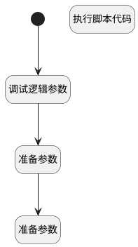

## 初始化面试默认值 <!-- {docsify-ignore-all} -->

   

### 处理过程




### 处理步骤说明

#### 开始 :id=Begin<sup class="footnote-symbol"> <font color=gray size=1>[开始]</font></sup>


*- N/A*
#### 调试逻辑参数 :id=DEBUGPARAM1<sup class="footnote-symbol"> <font color=gray size=1>[调试逻辑参数]</font></sup>


> [!NOTE|label:调试信息|icon:fa fa-bug]
> 调试输出参数`Default(传入变量)`的详细信息


#### 准备参数 :id=PREPAREPARAM1<sup class="footnote-symbol"> <font color=gray size=1>[准备参数]</font></sup>


1. 将`1` 设置给  `item(面试).STAGE_ID(面试阶段)`
2. 将`Default(传入变量).owner_id` 设置给  `item(面试).owner_id(面试负责人)`
3. 将`Default(传入变量).hr_applicant` 设置给  `item(面试).applicant_ids(候选人申请)`
4. 将`<p><strong>尊敬的</strong> 张三 <strong>先生/女士:</strong></p><p> &nbsp; &nbsp; &nbsp;您好! &nbsp;我司诚邀您参加 HRBP 的面试。烦请您在面试前，完成线上应聘信息表及大五性格测评，我司将做好信息保密工作。具体面试安排如下：</p><p> &nbsp; &nbsp; &nbsp;面试时间：2025年8月15日星期五 16:00</p><p> &nbsp; &nbsp; &nbsp;面试地点: 面试安排成功后会显示具体信息</p><p> &nbsp; &nbsp; &nbsp;联系人: &nbsp;梁进</p><p> &nbsp; &nbsp; &nbsp;联系电话： 0521-3769521</p>` 设置给  `Default(传入变量).EMAIL_CONTENT(邮件内容)`
5. 将`尊敬的 张三 先生/女士:
      您好!  我司诚邀您参加 HRBP 的面试。烦请您在面试前，完成线上应聘信息表及大五性格测评，我司将做好信息保密工作。具体面试安排如下：
      面试时间：2025年8月15日星期五 16:00
      面试地点: 面试安排成功后会显示具体信息
      联系人:  梁进
      联系电话： 0521-3769521` 设置给  `Default(传入变量).SMS_CONTENT(短信内容)`
6. 将`2` 设置给  `item(面试).START_TIME(面试时间)`
7. 将`2` 设置给  `item(面试).DURATION(面试时长)`
8. 将`item(面试)` 追加到  `list(面试列表)`

#### 执行脚本代码 :id=RAWSFCODE1<sup class="footnote-symbol"> <font color=gray size=1>[直接后台代码]</font></sup>


<p class="panel-title"><b>执行代码[Groovy]</b></p>

```groovy
def _default = logic.param("default").getReal();
def _list = new ArrayList();
def _map = new HashMap();

_map.put("stage_id","1");
_map.put("start_time","2");
_map.put("duration","2");

_list.add(_map);
_default.set("interviews",_list);
_default.set("email_content","<p><strong>尊敬的</strong> 张三 <strong>先生/女士:</strong></p><p> &nbsp; &nbsp; &nbsp;您好! &nbsp;我司诚邀您参加 HRBP 的面试。烦请您在面试前，完成线上应聘信息表及大五性格测评，我司将做好信息保密工作。具体面试安排如下：</p><p> &nbsp; &nbsp; &nbsp;面试时间：2025年8月15日星期五 16:00</p><p> &nbsp; &nbsp; &nbsp;面试地点: 面试安排成功后会显示具体信息</p><p> &nbsp; &nbsp; &nbsp;联系人: &nbsp;梁进</p><p> &nbsp; &nbsp; &nbsp;联系电话： 0521-3769521</p>");
_default.set("sms_content","尊敬的 张三 先生/女士:\n      您好!  我司诚邀您参加 HRBP 的面试。烦请您在面试前，完成线上应聘信息表及大五性格测评，我司将做好信息保密工作。具体面试安排如下：\n      面试时间：2025年8月15日星期五 16:00\n      面试地点: 面试安排成功后会显示具体信息\n      联系人:  梁进\n      联系电话： 0521-3769521");

```

#### 准备参数 :id=PREPAREPARAM2<sup class="footnote-symbol"> <font color=gray size=1>[准备参数]</font></sup>


1. 将`list(面试列表)` 设置给  `Default(传入变量).interviews`


### 实体逻辑参数

|    中文名   |    代码名    |  数据类型    |  实体   |备注 |
| --------| --------| -------- | -------- | --------   |
|传入变量(<i class="fa fa-check"/></i>)|Default|数据对象|[面试安排(HR_INTERVIEW_SCHEDULE)](module/hr/hr_interview_schedule.md)||
|面试|item|数据对象|[面试(HR_INTERVIEW)](module/hr/hr_interview.md)||
|面试列表|list|数据对象列表|[面试(HR_INTERVIEW)](module/hr/hr_interview.md)||
