## 职位状态计数器 <!-- {docsify-ignore-all} -->

   

### 处理过程

```plantuml
@startuml
hide empty description
<style>
root {
  HyperlinkColor #42b983
}
</style>

hide empty description
state "开始" as Begin <<start>> [[$./job_status_count#begin {"开始"}]]
state "招聘中职位" as RAWSQLCALL1  [[$./job_status_count#rawsqlcall1 {"招聘中职位"}]]
state "已结束职位" as RAWSQLCALL2  [[$./job_status_count#rawsqlcall2 {"已结束职位"}]]
state "结束" as END1 <<end>> [[$./job_status_count#end1 {"结束"}]]


Begin --> RAWSQLCALL1
RAWSQLCALL1 --> RAWSQLCALL2
RAWSQLCALL2 --> END1


@enduml
```




### 处理步骤说明

#### 开始 :id=Begin<sup class="footnote-symbol"> <font color=gray size=1>[开始]</font></sup>


*- N/A*
#### 招聘中职位 :id=RAWSQLCALL1<sup class="footnote-symbol"> <font color=gray size=1>[直接SQL调用]</font></sup>


<p class="panel-title"><b>执行sql语句</b></p>

```sql
select count(1) as open from hr_job where status = 'open'
```


重置参数`result(result)`，并将执行sql结果赋值给参数`result(result)`

#### 已结束职位 :id=RAWSQLCALL2<sup class="footnote-symbol"> <font color=gray size=1>[直接SQL调用]</font></sup>


<p class="panel-title"><b>执行sql语句</b></p>

```sql
select count(1) as closed from hr_job where status = 'closed'
```


重置参数`result(result)`，并将执行sql结果赋值给参数`result(result)`

#### 结束 :id=END1<sup class="footnote-symbol"> <font color=gray size=1>[结束]</font></sup>


返回 `result`


### 实体逻辑参数

|    中文名   |    代码名    |  数据类型    |  实体   |备注 |
| --------| --------| -------- | -------- | --------   |
|传入变量(<i class="fa fa-check"/></i>)|Default|数据对象|[招聘职位(HR_JOB)](module/hr/hr_job.md)||
|result|result|数据对象|||
