## 官网招聘职位申请信息保存 <!-- {docsify-ignore-all} -->

   

### 处理过程

```plantuml
@startuml
hide empty description
<style>
root {
  HyperlinkColor #42b983
}
</style>

hide empty description
state "开始" as Begin <<start>> [[$./website_apply_save#begin {"开始"}]]
state "准备参数" as PREPAREPARAM1  [[$./website_apply_save#prepareparam1 {"准备参数"}]]
state "实体行为" as DEACTION1  [[$./website_apply_save#deaction1 {"实体行为"}]]
state "结束" as END1 <<end>> [[$./website_apply_save#end1 {"结束"}]]


Begin --> PREPAREPARAM1
PREPAREPARAM1 --> DEACTION1
DEACTION1 --> END1


@enduml
```

### 处理步骤说明

#### 开始 :id=Begin [开始]

*- N/A*
#### 准备参数 :id=PREPAREPARAM1 [准备参数]

1. 将`Default(传入变量).apply_name` 设置给  `HR_APPLICANT(候选人申请).CANDIDATE_DISPLAY_NAME(候选人姓名)`
2. 将`Default(传入变量).apply_phone` 设置给  `HR_APPLICANT(候选人申请).MOBILE_PHONE(候选人手机号)`
3. 将`Default(传入变量).apply_emil` 设置给  `HR_APPLICANT(候选人申请).EMAIL_FROM(候选人邮箱)`
4. 将`Default(传入变量).apply_birthday` 设置给  `HR_APPLICANT(候选人申请).BIRTHDAY(出生日期)`
5. 将`Default(传入变量).apply_sex` 设置给  `HR_APPLICANT(候选人申请).GENDER(性别)`
6. 将`Default(传入变量).apply_address` 设置给  `HR_APPLICANT(候选人申请).ADDRESS(候选人所在地)`
7. 将`Default(传入变量).apply_job_name` 设置给  `HR_APPLICANT(候选人申请).JOB_NAME(求职岗位名称)`
8. 将`Default(传入变量).apply_salary_expected` 设置给  `HR_APPLICANT(候选人申请).SALARY_EXPECTED(期望薪资)`
9. 将`Default(传入变量).apply_last_edu_school` 设置给  `HR_APPLICANT(候选人申请).LAST_EDU_SCHOOL(毕业院校)`
10. 将`Default(传入变量).apply_last_exp_date` 设置给  `HR_APPLICANT(候选人申请).LAST_EDU_DATE(毕业时间)`
11. 将`Default(传入变量).apply_last_edu_speciality` 设置给  `HR_APPLICANT(候选人申请).LAST_EDU_SPECIALITY(所学专业)`
12. 将`Default(传入变量).apply_last_edu_academic_degree` 设置给  `HR_APPLICANT(候选人申请).LAST_EDU_ACADEMIC_DEGREE(最高学位)`
13. 将`Default(传入变量).apply_last_exp_company` 设置给  `HR_APPLICANT(候选人申请).LAST_EXP_COMPANY(最近工作公司)`
14. 将`Default(传入变量).apply_last_exp_job` 设置给  `HR_APPLICANT(候选人申请).LAST_EXP_JOB(最近工作岗位)`
15. 将`Default(传入变量).apply_last_exp_date` 设置给  `HR_APPLICANT(候选人申请).LAST_EXP_DATE(最近工作时间)`
16. 将`Default(传入变量).apply_experience` 设置给  `HR_APPLICANT(候选人申请).EXPERIENCE(工作经验)`
17. 将`Default(传入变量).image` 设置给  `HR_APPLICANT(候选人申请).IMAGE(候选人照片)`

#### 实体行为 :id=DEACTION1 [实体行为]

调用实体 [候选人申请(HR_APPLICANT)](module/hr/hr_applicant.md) 行为 [Create](module/hr/hr_applicant#行为) ，行为参数为`HR_APPLICANT(候选人申请)`

#### 结束 :id=END1 [结束]

*- N/A*

### 实体逻辑参数

|    中文名   |    代码名    |  数据类型    |  实体   |备注 |
| --------| --------| -------- | -------- | --------   |
|传入变量(<i class="fa fa-check"/></i>)|Default|数据对象|[招聘职位(HR_JOB)](module/hr/hr_job.md)||
|候选人申请|HR_APPLICANT|数据对象|[候选人申请(HR_APPLICANT)](module/hr/hr_applicant.md)||
