## 填充offer主键 <!-- {docsify-ignore-all} -->

   

### 处理过程

```plantuml
@startuml
hide empty description
<style>
root {
  HyperlinkColor #42b983
}
</style>

hide empty description
state "开始" as Begin <<start>> [[$./fillId#begin {"开始"}]]
state "设置ID为申请ID" as PREPAREPARAM1  [[$./fillId#prepareparam1 {"设置ID为申请ID"}]]
state "设置申请offer标识" as PREPAREPARAM2  [[$./fillId#prepareparam2 {"设置申请offer标识"}]]
state "结束" as END1 <<end>> [[$./fillId#end1 {"结束"}]]


Begin --> PREPAREPARAM1
PREPAREPARAM1 --> PREPAREPARAM2
PREPAREPARAM2 --> END1


@enduml
```

### 处理步骤说明

#### 开始 :id=Begin [开始]

*- N/A*
#### 设置ID为申请ID :id=PREPAREPARAM1 [准备参数]

1. 将`Default(传入变量).APPLICANT_ID(候选人申请)` 设置给  `Default(传入变量).ID(标识)`

#### 设置申请offer标识 :id=PREPAREPARAM2 [准备参数]

    无

#### 结束 :id=END1 [结束]

返回 `Default(传入变量)`

### 实体逻辑参数

|    中文名   |    代码名    |  数据类型    |  实体   |备注 |
| --------| --------| -------- | -------- | --------   |
|传入变量(<i class="fa fa-check"/></i>)|Default|数据对象|[OFFER录用(HR_OFFER)](module/hr/hr_offer.md)||
