## 更新申请关联offer <!-- {docsify-ignore-all} -->

   

### 处理过程

```plantuml
@startuml
hide empty description
<style>
root {
  HyperlinkColor #42b983
}
</style>

hide empty description
state "开始" as Begin <<start>> [[$./updateRelOffer#begin {"开始"}]]
state "设置offer标识" as PREPAREPARAM1  [[$./updateRelOffer#prepareparam1 {"设置offer标识"}]]
state "更新申请" as DEACTION1  [[$./updateRelOffer#deaction1 {"更新申请"}]]
state "结束" as END1 <<end>> [[$./updateRelOffer#end1 {"结束"}]]


Begin --> PREPAREPARAM1
PREPAREPARAM1 --> DEACTION1
DEACTION1 --> END1


@enduml
```

### 处理步骤说明

#### 开始 :id=Begin [开始]

*- N/A*
#### 设置offer标识 :id=PREPAREPARAM1 [准备参数]

1. 将`Default(传入变量).APPLICANT_ID(候选人申请)` 设置给  `HR_APPLICANT(申请).OFFER_ID`
2. 将`Default(传入变量).APPLICANT_ID(候选人申请)` 设置给  `HR_APPLICANT(申请).ID(标识)`

#### 更新申请 :id=DEACTION1 [实体行为]

调用实体 [候选人申请(HR_APPLICANT)](module/hr/hr_applicant.md) 行为 [Update](module/hr/hr_applicant#行为) ，行为参数为`HR_APPLICANT(申请)`

#### 结束 :id=END1 [结束]

返回 `HR_APPLICANT(申请)`

### 实体逻辑参数

|    中文名   |    代码名    |  数据类型    |  实体   |备注 |
| --------| --------| -------- | -------- | --------   |
|传入变量(<i class="fa fa-check"/></i>)|Default|数据对象|[OFFER录用(HR_OFFER)](module/hr/hr_offer.md)||
|申请|HR_APPLICANT|数据对象|[候选人申请(HR_APPLICANT)](module/hr/hr_applicant.md)||
