## offer提交 <!-- {docsify-ignore-all} -->

   

### 处理过程

```plantuml
@startuml
hide footbox
<style>
root {
  HyperlinkColor #42b983
}
</style>

hide empty description
state "开始" as Begin <<start>> [[$./commitoffer#begin {开始}]]
state "保存offer记录并刷新上下文" as RAWJSCODE1  [[$./commitoffer#rawjscode1 {保存offer记录并刷新上下文}]]


Begin --> RAWJSCODE1


@enduml
```




### 处理步骤说明

#### 开始 :id=Begin<sup class="footnote-symbol"> <font color=gray size=1>[开始]</font></sup>


#### 保存offer记录并刷新上下文 :id=RAWJSCODE1<sup class="footnote-symbol"> <font color=gray size=1>[直接前台代码]</font></sup>


<p class="panel-title"><b>执行代码</b></p>

```javascript
const form = view.getController('form');
await form.save();
console.log(view);
view.call('Refresh');
view.context.hr_offer = view.context.hr_applicant;
view.layoutPanel.panelItems.view_content.state.visible = false;
view.layoutPanel.panelItems.view_header.state.visible = false;
view.layoutPanel.panelItems.top_toolbar.state.visible = true;
view.layoutPanel.panelItems.detail_list.state.visible = true;
view.layoutPanel.panelItems.empty_group.state.visible = false;
view.RedrawView();
view.getController('grid').refresh();
view.getController('list').refresh();
```


### 实体逻辑参数

|    中文名   |    代码名    |  数据类型      |备注 |
| --------| --------| --------  | --------   |
|传入变量(<i class="fa fa-check"/></i>)|Default|数据对象||
