## 审批 <!-- {docsify-ignore-all} -->

   

### 处理过程

```plantuml
@startuml
hide empty description
<style>
root {
  HyperlinkColor #42b983
}
</style>

hide empty description
state "开始" as Begin <<start>> [[$./approval#begin {"开始"}]]
state "设置审核状态" as PREPAREPARAM1  [[$./approval#prepareparam1 {"设置审核状态"}]]
state "更新offer审批" as DEACTION1  [[$./approval#deaction1 {"更新offer审批"}]]
state "结束" as END1 <<end>> [[$./approval#end1 {"结束"}]]


Begin --> PREPAREPARAM1
PREPAREPARAM1 --> DEACTION1
DEACTION1 --> END1


@enduml
```

### 处理步骤说明

#### 开始 :id=Begin [开始]

*- N/A*
#### 设置审核状态 :id=PREPAREPARAM1 [准备参数]

1. 将`past` 设置给  `Default(传入变量).PERIOD(审批状态)`

#### 更新offer审批 :id=DEACTION1 [实体行为]

调用实体 [offer审核(HR_OFFER_APPROVAL)](module/hr/hr_offer_approval.md) 行为 [Update](module/hr/hr_offer_approval#行为) ，行为参数为`Default(传入变量)`

将执行结果返回给参数`Default(传入变量)`

#### 结束 :id=END1 [结束]

返回 `Default(传入变量)`

### 实体逻辑参数

|    中文名   |    代码名    |  数据类型    |  实体   |备注 |
| --------| --------| -------- | -------- | --------   |
|传入变量(<i class="fa fa-check"/></i>)|Default|数据对象|[offer审核(HR_OFFER_APPROVAL)](module/hr/hr_offer_approval.md)||
